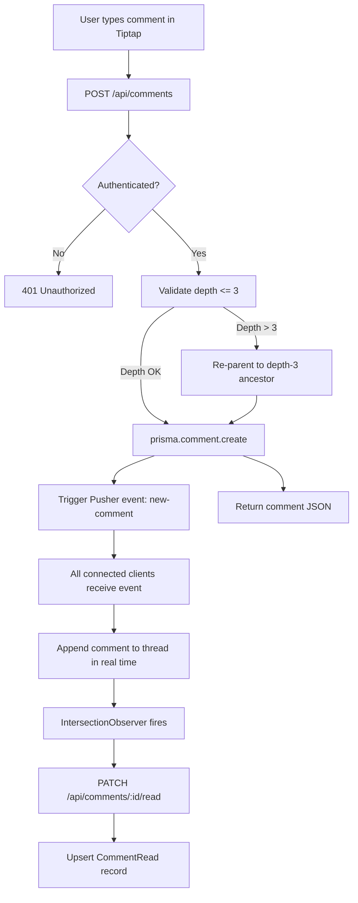
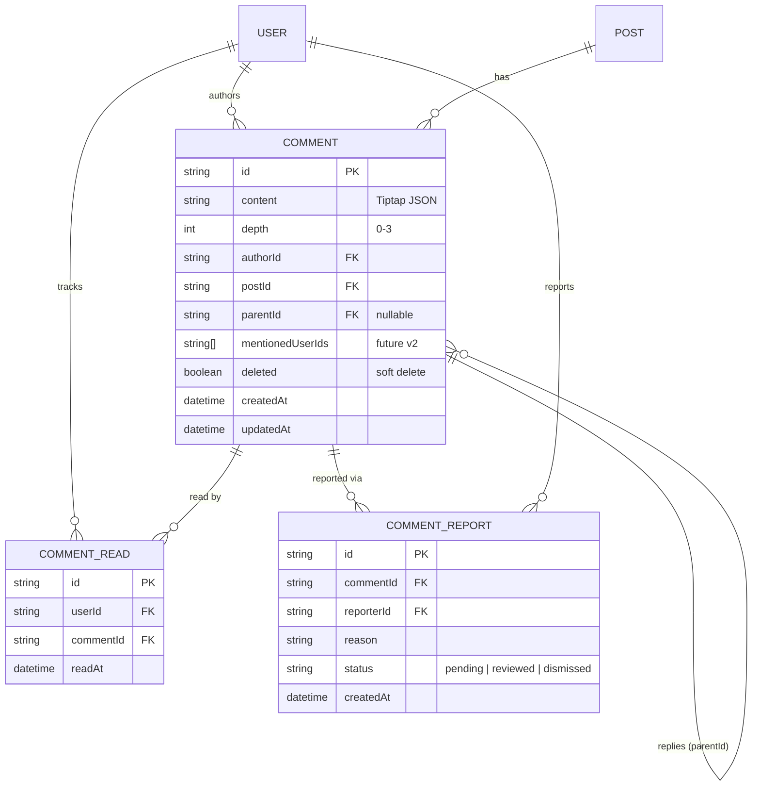

# Commenting System

## Overview

Add a threaded commenting system to the existing Next.js 14 App Router application. Users can post rich-text comments on posts using Tiptap, reply up to 3 levels deep (then flatten), receive real-time updates via Pusher, and track read/unread state per user per comment. Basic moderation is included (report, soft-delete by author or admin). The data model is designed to accommodate @mentions in a future v2.

## Requirements

- When a user submits a comment, it shall appear in real time for all viewers of the same post via Pusher
- The system shall support threaded replies nested up to 3 levels; replies beyond depth 3 shall be attached to the depth-3 ancestor
- Each user shall have per-comment read/unread tracking, updated when the comment scrolls into the viewport
- Rich text editing shall use Tiptap with support for bold, italic, inline code, links, and bullet lists
- Authors and admins shall be able to soft-delete comments; reported comments shall be flagged for admin review
- The Comment data model shall include a nullable `mentionedUserIds` field to support future @mentions

## Architecture

### System Diagram (ASCII)

```
Browser (React)
  |
  +-- <CommentEditor />  --- Tiptap Instance
  |       |
  |       v
  +-- POST /api/comments  --- Server Action: createComment()
  |       |
  |       +---> Prisma --> PostgreSQL (Comment, CommentRead tables)
  |       |
  |       +---> Pusher Server SDK --> Pusher Channel (post-{postId})
  |
  +-- <CommentThread />   <--- Pusher Client SDK (real-time subscription)
  |       |
  |       +-- <CommentItem />  (recursive, max depth 3)
  |               |
  |               +-- <CommentEditor /> (inline reply)
  |
  +-- useReadTracker()    --- IntersectionObserver --> PATCH /api/comments/[id]/read
```

### Data Flow (Mermaid)



### Entity Relationship Diagram (Mermaid)



## Library Choices

| Need | Library | Version | Alternatives Considered | Rationale |
|------|---------|---------|------------------------|-----------|
| Rich text editor | Tiptap | 2.2.x | Slate (28k stars, 60kB, manual collab), Lexical (17k stars, 22kB, manual collab) | Tiptap has built-in Yjs collab support for future needs, ProseMirror foundation is battle-tested, excellent React integration, and 45kB bundle is acceptable |
| Real-time updates | Pusher (pusher-js + pusher) | 8.x / 5.x | Ably (managed but no existing account), Socket.io (59k stars but requires persistent server, incompatible with Vercel serverless) | Already have a Pusher account, fully serverless-compatible, trivial integration with Next.js API routes |
| ORM | Prisma | 5.8.1 | Drizzle, Kysely | Already in the codebase, schema-first approach matches existing patterns |
| Database | PostgreSQL | 15 | N/A | Already in the stack, excellent for relational comment threading with recursive CTEs |
| Auth | NextAuth.js | v5 | N/A | Already in the codebase at `src/lib/auth.ts` |
| CSS | Tailwind CSS | 3.4.1 | N/A | Already in the codebase, component styling follows existing patterns |

## Phase 1: Database Schema & Models [in-progress]

- [ ] [CMT-01] Add `Comment` model to `prisma/schema.prisma` with fields: `id` (cuid), `content` (String for Tiptap JSON), `depth` (Int, default 0), `authorId` (FK to User), `postId` (FK to Post), `parentId` (nullable self-relation FK), `mentionedUserIds` (String[] for future v2), `deleted` (Boolean, default false), `createdAt`, `updatedAt` -- include `@@index([postId, createdAt])` and `@@index([parentId])` <- current
- [ ] [CMT-02] Add `CommentRead` model to `prisma/schema.prisma` with fields: `id` (cuid), `userId` (FK to User), `commentId` (FK to Comment), `readAt` (DateTime) -- include `@@unique([userId, commentId])` for upsert operations
- [ ] [CMT-03] Add `CommentReport` model to `prisma/schema.prisma` with fields: `id` (cuid), `commentId` (FK to Comment), `reporterId` (FK to User), `reason` (String), `status` (String, default "pending"), `createdAt` -- include `@@index([status])` for admin queries
- [ ] [CMT-04] Add reverse relations to `User` and `Post` models in `prisma/schema.prisma` (`comments`, `commentReads`, `commentReports` on User; `comments` on Post)
- [ ] [CMT-05] Run `npx prisma migrate dev --name add-commenting-system` and verify migration applies cleanly; inspect generated SQL for correct constraint naming and index creation

## Phase 2: API Layer (Server Actions & Routes) [pending]

- [ ] [CMT-06] Create `src/lib/actions/comments.ts` with server action `createComment(postId: string, content: string, parentId?: string)` -- validate auth via `getServerSession()`, compute `depth` from parent chain (clamp at 3 and re-parent if exceeded), call `prisma.comment.create()`, trigger Pusher event `new-comment` on channel `post-${postId}`, return serialized comment
- [ ] [CMT-07] Create `src/app/api/comments/route.ts` with `GET` handler -- accept `postId` query param, fetch top-level comments (`parentId: null`) with nested `include` for replies (3 levels), include `author` relation, order by `createdAt` ascending
- [ ] [CMT-08] Create `src/app/api/comments/[id]/route.ts` with `PATCH` handler for soft-delete -- validate that requester is author or admin, set `deleted: true` via `prisma.comment.update()`, trigger Pusher event `comment-deleted` on channel `post-${postId}`
- [ ] [CMT-09] Create `src/app/api/comments/[id]/read/route.ts` with `PATCH` handler -- upsert `CommentRead` record via `prisma.commentRead.upsert()` with `where: { userId_commentId }`, return 204
- [ ] [CMT-10] Create `src/app/api/comments/[id]/report/route.ts` with `POST` handler -- validate auth, create `CommentReport` record with `status: "pending"`, return 201
- [ ] [CMT-11] Create `src/lib/pusher.ts` exporting server-side Pusher instance (`new Pusher({ appId, key, secret, cluster })`) using environment variables `PUSHER_APP_ID`, `PUSHER_KEY`, `PUSHER_SECRET`, `PUSHER_CLUSTER`

## Phase 3: Comment UI Components [pending]

- [ ] [CMT-12] Create `src/components/comments/CommentEditor.tsx` -- Tiptap editor instance with extensions: StarterKit (bold, italic, lists), Link, Placeholder ("Write a comment..."); expose `onSubmit(content: string)` prop; include submit button with loading state; clear editor on successful submit
- [ ] [CMT-13] Create `src/components/comments/CommentItem.tsx` -- render single comment: author avatar + name, Tiptap HTML output (read-only via `generateHTML()`), relative timestamp, reply button (hidden if `depth >= 3`), delete button (visible to author/admin), report button; show "[deleted]" placeholder for soft-deleted comments; accept `depth` prop for indentation styling (`ml-${depth * 8}`)
- [ ] [CMT-14] Create `src/components/comments/CommentThread.tsx` -- recursive component that renders `CommentItem` and its children; accept `comments` array and `depth` prop; stop recursion at depth 3; pass inline `CommentEditor` when reply is active for a given comment
- [ ] [CMT-15] Create `src/components/comments/CommentSection.tsx` -- top-level container: fetch initial comments via `GET /api/comments?postId=X`, render `CommentThread` for top-level comments, render top-level `CommentEditor` at the bottom, manage optimistic state for new comments
- [ ] [CMT-16] Integrate `CommentSection` into `src/components/PostCard.tsx` (or the post detail page at `src/app/posts/[id]/page.tsx`) -- render below post content, pass `postId` prop

## Phase 4: Real-Time & Read Tracking [pending]

- [ ] [CMT-17] Create `src/hooks/usePusher.ts` -- custom hook that subscribes to Pusher channel `post-${postId}` on mount, returns event handlers, cleans up subscription on unmount; use `pusher-js` client SDK with env var `NEXT_PUBLIC_PUSHER_KEY` and `NEXT_PUBLIC_PUSHER_CLUSTER`
- [ ] [CMT-18] Create `src/hooks/useCommentRealtime.ts` -- hook built on `usePusher` that listens for `new-comment`, `comment-deleted`, and `comment-updated` events; updates local comment state by appending, removing, or modifying entries in the comment tree; deduplicate against optimistic updates using comment `id`
- [ ] [CMT-19] Wire `useCommentRealtime` into `CommentSection.tsx` -- merge real-time events into the comment list state; new comments from other users appear at the correct nesting level without page refresh
- [ ] [CMT-20] Create `src/hooks/useReadTracker.ts` -- custom hook using `IntersectionObserver` to detect when a `CommentItem` scrolls into the viewport; on intersection, call `PATCH /api/comments/${id}/read` (debounced, fire-once per comment); track read IDs in a `Set` to avoid duplicate calls
- [ ] [CMT-21] Integrate `useReadTracker` into `CommentItem.tsx` -- attach observer ref to comment element, apply visual styling for unread vs read comments (e.g., subtle left border highlight for unread); fetch initial read state from `GET /api/comments/read-status?postId=X` on mount

## Phase 5: Moderation & Polish [pending]

- [ ] [CMT-22] Implement report flow in `CommentItem.tsx` -- report button opens a small modal/popover with reason input (dropdown: "Spam", "Harassment", "Off-topic", "Other" + text field); submit calls `POST /api/comments/${id}/report`; show "Reported" confirmation state
- [ ] [CMT-23] Create `src/app/admin/reports/page.tsx` -- admin-only page listing pending `CommentReport` records with comment preview, reporter info, and actions: "Dismiss" (set status to `dismissed`), "Delete Comment" (soft-delete comment + set status to `reviewed`)
- [ ] [CMT-24] Add empty state and loading skeletons to `CommentSection.tsx` -- show skeleton placeholders while comments load; show "No comments yet -- be the first!" when empty; show error state with retry button on fetch failure
- [ ] [CMT-25] Add depth-clamping logic to `createComment` server action -- when `parentId` is provided and parent's depth is already 3, walk up the chain to find the depth-3 ancestor and re-parent to it; add unit test for this edge case
- [ ] [CMT-26] Add `aria-label` attributes to comment actions (reply, delete, report), ensure keyboard navigation through comment threads with Tab/Shift+Tab, and add `role="article"` to each `CommentItem` for screen reader landmark navigation

## Phase 6: Testing [pending]

- [ ] [CMT-27] Create `__tests__/unit/comments/depth-clamping.test.ts` -- unit tests for the depth calculation and re-parenting logic in `createComment`: test depth 0 (root), depth 1-3 (valid nesting), depth 4+ (should re-parent to depth-3 ancestor), and orphaned parent edge case
- [ ] [CMT-28] Create `__tests__/unit/comments/comment-serialization.test.ts` -- unit tests for Tiptap JSON-to-HTML rendering via `generateHTML()`: test bold, italic, links, code, bullet lists, empty content, and malicious HTML sanitization
- [ ] [CMT-29] Create `__tests__/integration/comments/api.test.ts` -- integration tests using Prisma test client: test `POST /api/comments` (create root comment, create reply, create deeply nested reply that gets re-parented), `GET /api/comments?postId=X` (returns threaded structure), `PATCH /api/comments/[id]` (soft-delete by author, reject unauthorized delete), `PATCH /api/comments/[id]/read` (upsert read record), `POST /api/comments/[id]/report` (create report)
- [ ] [CMT-30] Create `__tests__/integration/comments/pusher.test.ts` -- integration tests with mocked Pusher: verify `new-comment` event is triggered on create with correct channel and payload, verify `comment-deleted` event on soft-delete, verify no event on failed validation
- [ ] [CMT-31] Create `__tests__/e2e/comments.spec.ts` (Playwright) -- end-to-end test: navigate to post detail page, verify comment section renders, type and submit a comment via Tiptap editor, verify comment appears in thread, reply to comment (verify nesting), soft-delete own comment (verify "[deleted]" placeholder), verify 3-level nesting limit (4th reply is flattened)
- [ ] [CMT-32] Create `__tests__/e2e/comments-realtime.spec.ts` (Playwright) -- two-browser-context test: open same post in two contexts, post comment in context A, verify it appears in context B without refresh; delete comment in context A, verify it disappears in context B

## Testing Strategy

### Unit Tests
- `__tests__/unit/comments/depth-clamping.test.ts` -- depth calculation, re-parenting logic, edge cases (orphan parent, depth exactly 3)
- `__tests__/unit/comments/comment-serialization.test.ts` -- Tiptap JSON to HTML, XSS sanitization, empty content handling
- Framework: Vitest (or Jest if already configured in the project)

### Integration Tests
- `__tests__/integration/comments/api.test.ts` -- full CRUD through API routes with real Prisma client against test database
- `__tests__/integration/comments/pusher.test.ts` -- Pusher event triggering with mocked Pusher SDK
- Framework: Vitest with Prisma test utilities, msw for HTTP mocking

### End-to-End Tests
- `__tests__/e2e/comments.spec.ts` -- complete user flow: create, reply, delete, nesting limit
- `__tests__/e2e/comments-realtime.spec.ts` -- multi-user real-time synchronization
- Framework: Playwright

### Edge Case Tests
- Depth clamping: comment at depth 4+ re-parents correctly
- Concurrent writes: two users replying to the same comment simultaneously
- Soft-delete cascade: deleting a parent with replies shows "[deleted]" but preserves child comments
- Read tracking: rapid scrolling does not fire duplicate PATCH requests (debounce test)
- Tiptap content: empty submit blocked, oversized content (>10KB) rejected, malicious HTML stripped
- Auth boundary: unauthenticated user cannot create/delete/report comments
- Pusher failure: graceful degradation when Pusher is unreachable (comments still work via refresh)

---

## Resume Context

> Spec is freshly written and approved. No implementation work has started yet.
> The first task is CMT-01: adding the `Comment` model to `prisma/schema.prisma`.
> The existing schema is at `prisma/schema.prisma` and currently contains `User`,
> `Post`, and `Tag` models. Auth is handled by NextAuth.js v5 at `src/lib/auth.ts`.
>
> Key files to touch first:
> - `prisma/schema.prisma` -- add Comment, CommentRead, CommentReport models
> - `src/lib/actions/comments.ts` -- new file for server actions
> - `src/lib/pusher.ts` -- new file for Pusher server instance
> - `src/components/comments/` -- new directory for all comment components
>
> Environment variables needed before Phase 2: `PUSHER_APP_ID`, `PUSHER_KEY`,
> `PUSHER_SECRET`, `PUSHER_CLUSTER`, `NEXT_PUBLIC_PUSHER_KEY`,
> `NEXT_PUBLIC_PUSHER_CLUSTER`.

## Decision Log

| Date | Decision | Rationale |
|------|----------|-----------|
| 2026-03-06 | Tiptap over Slate/Lexical | Built-in Yjs collaborative editing support for future v2, ProseMirror foundation is production-proven, React integration is cleanest of the three options |
| 2026-03-06 | Pusher over Socket.io/Ably | Existing Pusher account eliminates setup cost; fully serverless-compatible with Vercel (Socket.io requires persistent server); Ably would require new account and migration |
| 2026-03-06 | 3-level nesting max with flatten | Deeper nesting becomes unreadable on mobile; re-parenting to depth-3 ancestor preserves thread context while keeping UI manageable |
| 2026-03-06 | Per-user CommentRead table over read flags on Comment | Supports multi-user read tracking without bloating the Comment row; unique constraint on (userId, commentId) enables efficient upsert |
| 2026-03-06 | Soft-delete over hard delete | Preserves thread integrity -- child comments remain visible with a "[deleted]" parent placeholder; enables admin audit trail |
| 2026-03-06 | Store Tiptap content as JSON string, not HTML | JSON preserves editor state for future editing; HTML is generated at render time via `generateHTML()`; avoids XSS surface area from stored HTML |
| 2026-03-06 | Defer @mentions to v2 | Reduces scope for initial release; `mentionedUserIds` field in schema ensures no migration needed when v2 ships |
| 2026-03-06 | IntersectionObserver for read tracking | More performant than scroll event listeners; native browser API with good support; fire-once pattern with debounce prevents API spam |

## Deviations

| Task | Spec Said | Actually Did | Why |
|------|-----------|-------------|-----|
